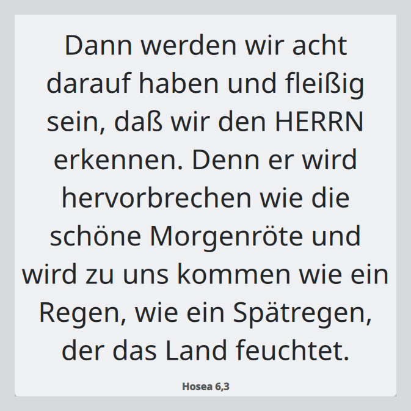

[English](README.md) · **Deutsch**

# Bible Verse Widget

Jeden Tag ein Bibelvers, direkt auf dem Schreibtisch — kein Fenster zum Öffnen,
kein Konto, kein Internet.



Zwei native Widgets, eine gemeinsame Versliste:

| Desktop | Widget | Wo es liegt |
|---|---|---|
| **KDE Plasma 6** | Plasmoid | auf dem Desktop oder in der Leiste, X11 und Wayland |
| **Cinnamon** (Linux Mint, Fedora Cinnamon Spin, Ubuntu Cinnamon, Debian, Arch …) | Desklet | auf dem Desktop |

Beide zeigen am selben Tag **denselben Vers** — auf Deutsch, Englisch oder
Spanisch.

## Warum nur diese beiden Desktops

Desktop-Widgets sind kein Linux-weites Konzept. KDE Plasma (Plasmoids) und
Cinnamon (Desklets) sind die beiden Desktops, die überhaupt eine echte
Widget-Ebene auf dem Desktop haben. GNOME hat bewusst keine, und Mutter
implementiert auch das `wlr-layer-shell`-Protokoll nicht — es gibt dort also
keinen generischen Wayland-Weg auf den Hintergrund. XFCE und MATE bieten nur
Leisten-Plugins.

Statt überall etwas Halbfertiges auszuliefern, enthält dieses Repository zwei
sauber native Widgets. Versdaten und Auswahllogik sind geteilt, ein drittes
Frontend wäre also später günstig zu ergänzen.

## Installation

### KDE Plasma

```sh
make install-plasmoid
```

Dann Rechtsklick auf den Desktop → *Bearbeitungsmodus* → oben in der Leiste
*Miniprogramme hinzufügen oder verwalten …* → **Bibelvers**.

Plasma 6 hat das hinter den Bearbeitungsmodus verschoben; im Rechtsklickmenü
der Arbeitsfläche gibt es keinen Eintrag *Widgets hinzufügen…* mehr. Und KDE
nennt Widgets auf Deutsch *Miniprogramme*. Wer die Menüs überspringen möchte:

```sh
qdbus6 org.kde.plasmashell /PlasmaShell org.kde.PlasmaShell.toggleWidgetExplorer
```

### Cinnamon

```sh
make install-desklet
```

Dann *Systemeinstellungen* → *Desklets* → **Bible Verse** → *Zum Desktop
hinzufügen*.

## Einstellungen

Beide Widgets bieten dieselben Optionen:

- **Quelle** — die kuratierte Liste oder die Herrnhuter Losungen
- **Übersetzung** — der Systemsprache folgen oder fest auswählen
- **Stelle anzeigen** — Buch, Kapitel und Vers unter dem Text
- **Textgröße** — feste Punktgröße oder an das Widget angepasst (Plasma)
- **Schriftart, kursiv, Ausrichtung, Farbe**
- **Hintergrund** — der Plasma-Hintergrund (Standard) oder keiner, wahlweise
  mit Schatten hinter dem Text, damit er auch auf hellem Hintergrundbild lesbar
  bleibt

**Ein Klick auf das Widget kopiert** Vers, Stelle und Übersetzung in die
Zwischenablage.

## Wie der Vers des Tages bestimmt wird

Der Vers ergibt sich allein aus dem lokalen Datum — kein gespeicherter Zustand,
kein Server. Die Liste wird pro Kalenderjahr deterministisch gemischt und dann
der Reihe nach durchlaufen. So wiederholt sich innerhalb eines Jahres kein Vers,
und jedes Gerät zeigt am selben Tag denselben Vers, unabhängig von Desktop und
Sprache.

Der Algorithmus ist in [`shared/selection.md`](shared/selection.md)
spezifiziert und einmal in [`shared/selection.js`](shared/selection.js)
implementiert, das beide Frontends wörtlich verwenden.
[`tests/test_selection.py`](tests/test_selection.py) enthält eine
Referenzimplementierung und prüft das JavaScript dagegen.

## Woher die Verse kommen

Das Widget hat zwei Quellen, umschaltbar in den Einstellungen.

### Kuratierte Liste (Standard)

1000 Stellen, von Hand gepflegt in
[`data/references.txt`](data/references.txt) und gegen gemeinfreie Texte
aufgelöst. 600 aus dem Alten, 400 aus dem Neuen Testament, alle 66 Bücher
vertreten.

Damit klar ist, was das ist: **meine eigene Auswahl**, nicht die einer Kirche.
Sie neigt zu bekannten und ermutigenden Versen. Wem das wichtig ist, der
bearbeitet die Datei — sie enthält nichts als Stellenangaben, eine pro Zeile,
und `make data` prüft jede Änderung.

Der Wortlaut stammt aus gemeinfreien Texten:

| Sprache | Übersetzung | Lizenz |
|---|---|---|
| Deutsch | Lutherbibel 1912 | gemeinfrei |
| Englisch | World English Bible | gemeinfrei |
| Spanisch | Reina-Valera 1909 | gemeinfrei |

Zur Laufzeit wird nichts nachgeladen — die Verse liegen in jedem Paket, diese
Quelle läuft also vollständig offline und braucht keine Netzwerkrechte. Von Hand
gepflegt werden nur die Stellenangaben; der Wortlaut kommt immer aus den
Quelltexten und wird von `tools/build_verses.py` eingesetzt.

#### Zur Verszählung

Deutsche, englische und spanische Bibeln zählen einige Kapitel unterschiedlich,
dieselbe Stellenangabe kann also auf verschiedene Passagen zeigen. Der Build
weist Stellen aus bekannten Problemkapiteln zurück und vergleicht zusätzlich die
Länge der drei Fassungen jeder Stelle. Diese zweite Prüfung hat Johannes 10
aufgedeckt — alle drei Ausgaben haben dort 42 Verse, aber Luther 1912 teilt
Vers 10 in zwei — und Jona 2, wo die Verszahlen ebenfalls übereinstimmen und
Reina-Valera trotzdem um eins verschoben ist.

### Herrnhuter Losungen

Die [Losungen](https://www.losungen.de/) erscheinen bei der Evangelischen
Brüder-Unität (Herrnhuter Brüdergemeine) seit **1731** jährlich — das am
längsten durchgehend publizierte Andachtsbuch der Welt, rund eine Million
Exemplare pro Jahr in über 50 Sprachen.

Jeder Tag hat zwei Texte. Die **Losung** ist ein Vers aus dem Alten Testament,
Jahre im Voraus **durch das Los gezogen** aus einem Vorrat von etwa 1800
vorausgewählten Versen — niemand entscheidet also, welcher Vers auf welchen Tag
fällt. Der **Lehrtext** ist ein Vers aus dem Neuen Testament, den die Redaktion
als Antwort darauf auswählt.

Die Losungen sind für nicht-kommerzielle Nutzung kostenfrei, aber **kein freier
Inhalt** — kostenpflichtige Software und kommerzielle Seiten sind ausgeschlossen,
was mit der GPL dieses Programms unvereinbar ist. Die Daten liegen deshalb nicht
hier. Lade die Jahresdatei selbst unter <https://www.losungen.de/digital/> herunter,
wo du die Nutzungsbedingungen akzeptierst. Importieren kannst du sie dann
entweder in den Einstellungen des Widgets — dort gibt es einen Knopf
**Jahresdatei einspielen…**, sobald die Quelle auf die Losungen steht — oder im
Terminal:

```sh
make losungen FILE=~/Downloads/Losung_2026_XML.zip
```

Das schreibt `~/.local/share/bible-verse-widget/losungen-<Jahr>.json`, das beide
Widgets lesen. Das muss jedes Jahr wiederholt werden, weil immer nur das
laufende und das kommende Jahr veröffentlicht sind.

## Mitarbeiten

```sh
make data     # data/verses/*.json aus data/references.txt neu auflösen
make sync     # gemeinsame Dateien in beide Frontends kopieren
make check    # prüfen, ob die erzeugten Dateien aktuell sind, dann Tests
make dist     # Store-Pakete bauen
```

Die erzeugten Dateien liegen im Repository, weil KDE Store und cinnamon-spices
in sich geschlossene Pakete verteilen. `make check` schlägt fehl, wenn sie
veraltet sind.

## Lizenz

[GPL-3.0-or-later](LICENSE). Die Bibeltexte sind gemeinfrei.
