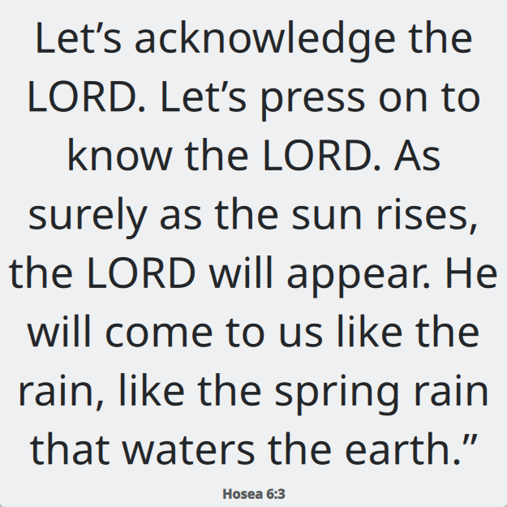

**English** · [Deutsch](README.de.md)

# Bible Verse Widget

A Bible verse for every day, sitting directly on your desktop — no window to
open, no account, no network.



Two native widgets, one shared verse list:

| Desktop | Widget | Where it lives |
|---|---|---|
| **KDE Plasma 6** | Plasmoid | on the desktop or in a panel, X11 and Wayland |
| **Cinnamon** (Linux Mint, Fedora Cinnamon Spin, Ubuntu Cinnamon, Debian, Arch …) | Desklet | on the desktop |

Both show the **same verse on the same day**, in German, English or Spanish.

## Why only these two desktops

Desktop widgets are not a Linux-wide concept. KDE Plasma (plasmoids) and
Cinnamon (desklets) are the two desktops that have a real widget layer on the
desktop itself. GNOME deliberately has none, and Mutter does not implement the
`wlr-layer-shell` protocol either, so there is no generic Wayland route to the
desktop background. XFCE and MATE only offer panel plugins.

Rather than shipping something half-working everywhere, this repository ships
two properly native widgets. The verse data and the selection algorithm are
shared, so adding a third frontend later is cheap.

## Install

### KDE Plasma

```sh
make install-plasmoid
```

Then right-click the desktop → *Enter Edit Mode* → *Add or Manage Widgets…* in
the toolbar at the top → **Bible Verse**.

Plasma 6 moved this behind edit mode; there is no *Add Widgets…* entry in the
desktop context menu any more. If you would rather skip the menus:

```sh
qdbus6 org.kde.plasmashell /PlasmaShell org.kde.PlasmaShell.toggleWidgetExplorer
```

### Cinnamon

```sh
make install-desklet
```

Then *System Settings* → *Desklets* → **Bible Verse** → *Add to desktop*.

## Configure

Both widgets offer the same settings:

- **Translation** — follow the system language, or pick one explicitly
- **Show reference** — book, chapter and verse under the text
- **Text size** — a fixed point size, or scaled to the widget (Plasma)
- **Font, italic, alignment, colour**
- **Background** — the Plasma panel background (default), or none, optionally
  with a shadow behind the text so it stays readable on a bright wallpaper

**Click the widget to copy** the verse, its reference and the translation to the
clipboard.

## How the verse of the day is chosen

The verse is a pure function of the local date — no stored state, no server.
The list is deterministically shuffled once per calendar year and then walked in
order, so no verse repeats within a year, and every machine shows the same verse
on the same day regardless of desktop or language.

The algorithm is specified in [`shared/selection.md`](shared/selection.md) and
implemented once in [`shared/selection.js`](shared/selection.js), which both
frontends use verbatim. [`tests/test_selection.py`](tests/test_selection.py)
holds a reference implementation and checks the JavaScript against it.

## The text

434 curated references, resolved against public-domain texts:

| Language | Translation | Licence |
|---|---|---|
| German | Lutherbibel 1912 | public domain |
| English | World English Bible | public domain |
| Spanish | Reina-Valera 1909 | public domain |

Nothing is fetched at runtime — the verses ship inside each package, so both
widgets work fully offline and need no network permission.

Only the references are maintained by hand, in
[`data/references.txt`](data/references.txt); the wording always comes from the
source texts via `tools/build_verses.py`.

### A note on versification

German, English and Spanish Bibles disagree about the numbering of some
chapters, so the same reference can point at different passages. The build
rejects references from known-divergent chapters, and additionally compares the
length of the three renderings of every reference — that second check is what
caught John 10, where all three editions have 42 verses but Luther 1912 splits
verse 10 in two.

## Working on it

```sh
make data     # re-resolve data/verses/*.json from data/references.txt
make sync     # copy the shared assets into both frontends
make check    # verify the generated files are current, then run the tests
make dist     # build the store packages
```

Generated files are committed, because the KDE Store and cinnamon-spices
distribute self-contained packages. `make check` fails if they are stale.

## Licence

[GPL-3.0-or-later](LICENSE). The Bible texts are in the public domain.
